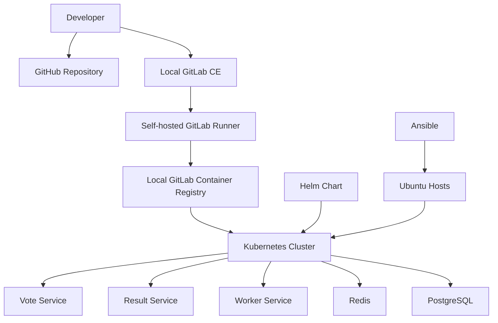
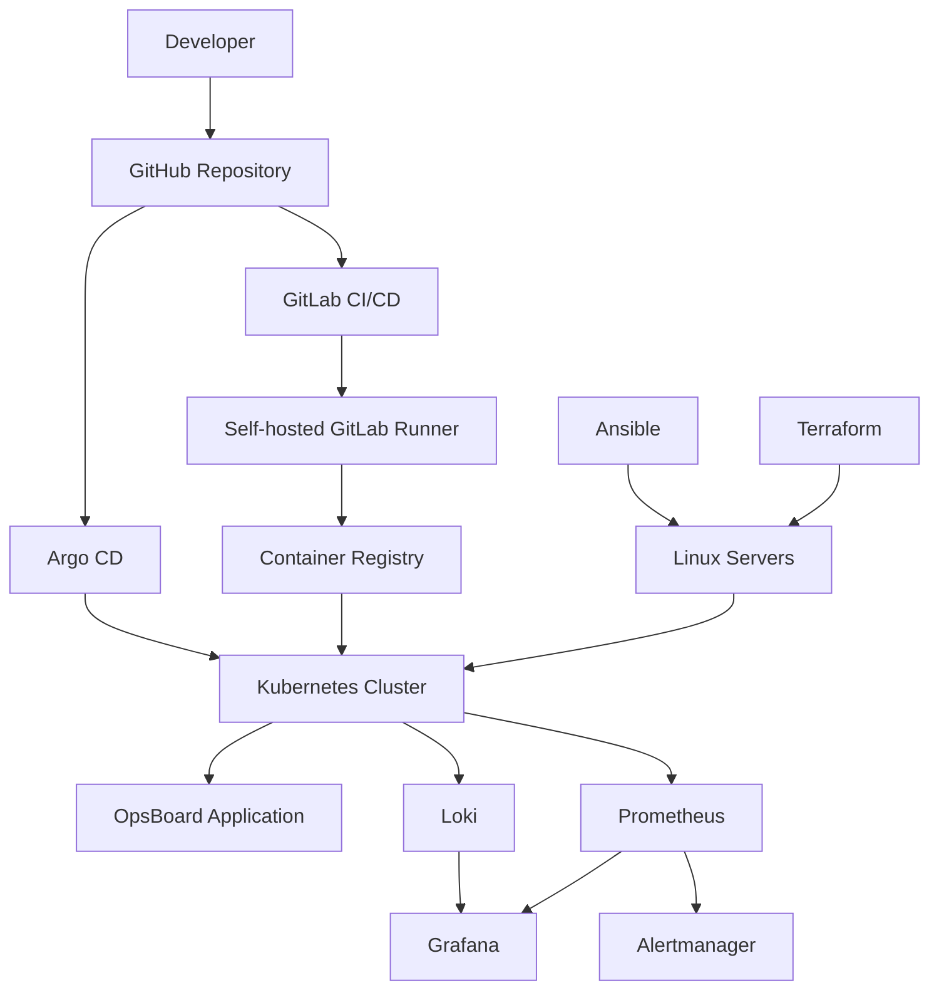

# OpsBoard

<p align="center">
  <strong>
    A production-like cloud-native DevOps platform designed to demonstrate infrastructure automation, Kubernetes operations, CI/CD, GitOps delivery, observability, security, and multi-environment deployment practices.
  </strong>
</p>

<p align="center">
  Linux · Docker · containerd · Kubernetes · Terraform · Ansible · Helm · GitHub · GitLab CE · GitLab CI/CD · Argo CD · Prometheus · Grafana · Loki
</p>

---

## Overview

OpsBoard is a portfolio-grade DevOps project that demonstrates how to build, deploy, operate, monitor, secure, and reproduce a modern cloud-native platform.

The project is initially being developed inside a local VirtualBox lab using two Ubuntu Linux virtual machines.

The current lab is used to design, automate, test, troubleshoot, and validate the platform before moving it to real Linux servers.

After the local environment is complete and reproducible, the same repository and automation approach will be used to provision and deploy the platform to real Ubuntu servers.

The main goal is to manage infrastructure, configuration, applications, CI/CD, and platform services through code rather than relying on manual administration.

---

## Project Status

> **Status: Work in progress**

The project is being implemented incrementally. Each completed phase is validated, documented, and committed to version control.

### Current Progress

* [x] Git repository initialized
* [x] Base repository structure created
* [x] Security-focused `.gitignore` added
* [x] Initial project documentation created
* [x] Linux host preparation
* [x] SSH key-based automation
* [x] Ansible inventory and roles
* [ ] Terraform infrastructure configuration
* [x] Kubernetes cluster deployment
* [x] Voting application integration
* [x] Docker image build process
* [x] Kubernetes application deployment
* [x] Helm chart configuration
* [x] Local GitLab CE installation and configuration
* [x] Self-hosted GitLab Runner integration
* [x] Local GitLab CI/CD pipeline validation
* [x] Local GitLab Container Registry integration
* [x] Kubernetes private registry authentication
* [x] Kubernetes image migration to local GitLab registry
* [x] Argo CD GitOps deployment
* [ ] Prometheus metrics collection
* [ ] Grafana dashboards
* [ ] Loki centralized logging
* [ ] Alertmanager configuration
* [ ] Development environment validation
* [ ] Staging environment deployment
* [ ] Production environment deployment
* [ ] Security hardening
* [ ] Backup and recovery procedures

---

## Project Goals

OpsBoard is designed to demonstrate practical DevOps and cloud-native engineering skills across the full platform lifecycle.

The project covers or will cover:

* Linux server administration
* Infrastructure as Code
* Configuration management
* Containerization
* Kubernetes cluster administration
* Continuous integration
* Continuous delivery
* GitOps-based deployments
* Multi-environment configuration
* Monitoring and alerting
* Centralized logging
* Secrets management
* Security scanning
* Reproducible infrastructure
* Backup and disaster recovery
* Production-style documentation

---

## Technology Stack

| Category                      | Technology                      |
| ----------------------------- | ------------------------------- |
| Operating System              | Ubuntu Linux                    |
| Containerization              | Docker                          |
| Kubernetes Container Runtime  | containerd                      |
| Container Orchestration       | Kubernetes                      |
| Kubernetes Bootstrap          | kubeadm                         |
| Infrastructure as Code        | Terraform                       |
| Configuration Management      | Ansible                         |
| Kubernetes Package Management | Helm                            |
| GitOps                        | Argo CD                         |
| Primary Source Control        | GitHub                          |
| CI/CD Platform                | Local GitLab CE + GitLab CI/CD  |
| CI Runner                     | Self-hosted GitLab Runner       |
| Container Registry            | Local GitLab Container Registry |
| Metrics Collection            | Prometheus                      |
| Dashboards                    | Grafana                         |
| Centralized Logging           | Loki                            |
| Log Collection                | Grafana Alloy                   |
| Alerting                      | Alertmanager                    |

---

## Environment Strategy

OpsBoard is designed to support three deployment environments.

| Environment | Purpose                                                               |
| ----------- | --------------------------------------------------------------------- |
| `dev`       | Local development, experimentation, integration, and frequent testing |
| `staging`   | Production-like validation before release                             |
| `prod`      | Stable production deployment                                          |

The current two-node VirtualBox lab represents the initial `dev` environment.

The long-term goal is to reuse the same Terraform, Ansible, Kubernetes, Helm, GitLab CI/CD, and Argo CD patterns across staging and production using environment-specific variables and policies.

Environment-specific information such as IP addresses, credentials, domain names, certificates, registry credentials, and secrets should not be hard-coded into reusable project configuration.

---

## Current Development Architecture

The current lab separates source control, CI/CD, container publishing, and Kubernetes execution while keeping the environment small enough to run locally.



GitHub remains the primary source-control platform.

The repository is also pushed to the local GitLab CE instance so GitLab can provide CI/CD execution and container registry services without relying on paid GitLab-hosted runners.

---

## Target Architecture

As the project progresses, Argo CD and the observability stack will be added.



When the local development environment is complete, the architecture will be reproduced on real Linux servers using automated infrastructure and configuration management.

---

## Repository Structure

```text
opsboard/
├── ansible/              # Host configuration and Kubernetes automation
├── app/                  # OpsBoard application source code
│   ├── result/
│   ├── seed-data/
│   ├── vote/
│   ├── worker/
│   └── healthchecks/
├── argocd/               # Future Argo CD applications and GitOps configuration
├── docs/                 # Architecture diagrams and project documentation
├── helm/
│   └── opsboard/         # OpsBoard Helm chart and values
├── kubernetes/
│   ├── base/             # Kubernetes workload manifests
│   └── storage/          # Storage-related Kubernetes resources
├── terraform/
│   ├── environments/     # Environment-specific Terraform configuration
│   └── modules/          # Reusable Terraform modules
├── .github/              # GitHub-specific configuration
├── .gitlab-ci.yml        # GitLab CI/CD pipeline definition
├── .gitignore
├── ansible.cfg
└── README.md
```

As the project grows, major directories will contain their own documentation and environment-specific configuration where appropriate.

---

## Source Control and CI/CD Strategy

OpsBoard intentionally separates source control from CI/CD execution.

### GitHub

GitHub remains the primary repository and long-term source-control platform.

### Local GitLab CE

A self-managed GitLab CE instance is running inside the development environment and provides:

* GitLab CI/CD
* project-level CI/CD configuration
* self-hosted runner integration
* local container registry
* pipeline execution without paid GitLab-hosted runners

### Self-hosted GitLab Runner

A GitLab Runner is hosted on the development infrastructure and registered with the local OpsBoard GitLab project.

The runner currently uses the shell executor.

A basic pipeline has already been successfully executed through the local GitLab instance, validating the complete CI execution path.

---

## Container Registry Strategy

OpsBoard application images are stored in the local GitLab Container Registry during development.

The following application components are currently built as container images:

* `vote`
* `result`
* `worker`

Redis and PostgreSQL continue to use trusted upstream container images.

Kubernetes authenticates to the private local registry using a dedicated image pull secret backed by a least-privilege GitLab deploy token with registry read access.

The current development registry uses local lab networking.

The future staging and production implementation will use proper DNS, TLS, firewall configuration, and production-grade credential management.

---

## Application Deployment

The application currently consists of:

```text
Vote
 │
 ▼
Redis
 │
 ▼
Worker
 │
 ▼
PostgreSQL
 │
 ▼
Result
```

The application workloads are deployed to Kubernetes and packaged through the OpsBoard Helm chart.

The Helm chart is the deployment source of truth for the current Kubernetes release.

Image repositories, image tags, replica counts, resource settings, security context, and application configuration are controlled through Helm values where appropriate.

---

## Deployment Workflow

The current and target application delivery workflow is:

```text
Developer
   │
   ▼
Git Repository
   │
   ▼
Local GitLab CI/CD
   │
   ├── Code validation
   ├── Unit testing
   ├── Docker image build
   ├── Dependency scanning
   ├── Container image scanning
   └── Image publishing
   │
   ▼
Local GitLab Container Registry
   │
   ▼
Helm / Argo CD
   │
   ▼
Kubernetes Cluster
   │
   ├── Vote
   ├── Result
   ├── Worker
   ├── Redis
   └── PostgreSQL
```

At the current stage, Helm manages application deployment.

Argo CD will later become the GitOps reconciliation layer.

---

## Infrastructure Workflow

The target infrastructure deployment process follows this sequence:

```text
Terraform
   │
   ▼
Linux Servers
   │
   ▼
Ansible
   │
   ├── Operating system configuration
   ├── Security configuration
   ├── Docker installation
   ├── containerd installation
   ├── Kubernetes package installation
   └── Cluster prerequisites
   │
   ▼
kubeadm
   │
   ▼
Kubernetes Cluster
   │
   ▼
Helm and Argo CD
   │
   ▼
Applications and Platform Services
```

Terraform is responsible for infrastructure provisioning.

Ansible is responsible for machine configuration and software installation.

Kubernetes manages containerized workloads.

Helm packages and configures Kubernetes applications.

Argo CD will later reconcile the desired state stored in Git with the running cluster.

---

## Automation Principles

The project aims to minimize manual infrastructure configuration.

Any configuration initially performed manually during learning or troubleshooting should later be incorporated into automation where appropriate.

Examples include:

* operating system preparation
* package installation
* Docker configuration
* containerd configuration
* Kubernetes prerequisites
* registry configuration
* GitLab Runner installation
* Helm installation
* cluster initialization
* worker-node configuration

This ensures that the platform can eventually be reproduced on clean Linux servers rather than depending on the state of the current VirtualBox machines.

---

## Observability

The platform will include a complete observability stack for metrics, dashboards, logs, and alerts.

### Metrics

Prometheus will collect metrics from:

* Kubernetes control-plane components
* Kubernetes worker nodes
* application workloads
* containers
* ingress components
* platform services

### Dashboards

Grafana will provide dashboards for:

* cluster health
* node utilization
* pod performance
* application metrics
* deployment status
* system alerts
* centralized logs

### Logging

Loki will provide centralized log storage.

Grafana Alloy will collect and forward logs from:

* Kubernetes pods
* application containers
* system services
* ingress components
* platform services

### Alerting

Alertmanager will process alerts generated by Prometheus and route them to configured notification channels.

---

## Security Principles

Security is integrated throughout the project rather than being treated only as a final phase.

Practices already implemented or planned include:

* least-privilege Linux administration
* SSH key-based authentication
* restricted root usage
* non-root application containers
* secrets excluded from Git
* registry credentials stored as Kubernetes secrets
* least-privilege registry deploy tokens
* encrypted Ansible variables
* protected CI/CD variables
* protected Terraform state
* dependency scanning
* container image scanning
* Kubernetes RBAC
* namespace isolation
* network policies
* pod security controls
* TLS certificate management
* secure secrets management
* audit logging
* firewall configuration
* controlled backup and recovery procedures

Sensitive values such as passwords, private keys, tokens, kubeconfig files, cloud credentials, registry credentials, and production secrets must never be committed to the repository.

---

## GitOps Strategy

Argo CD will eventually provide continuous GitOps reconciliation.

Once implemented, Argo CD will compare the desired state stored in Git with the actual state running inside Kubernetes.

Git will become the authoritative source of truth for:

* application deployments
* Kubernetes manifests
* Helm values
* environment configuration
* monitoring configuration
* logging configuration
* platform services

The goal is for reviewed and committed Git changes to drive deployment rather than relying on manual cluster modifications.

Until Argo CD is introduced, Helm remains the primary deployment mechanism.

---

## Local Development Environment

The current development environment consists of two Ubuntu Linux virtual machines running in VirtualBox.

| Node        | Current Responsibilities                                                                                                         |
| ----------- | -------------------------------------------------------------------------------------------------------------------------------- |
| `ubuntuvm1` | Kubernetes control-plane node, Ansible control node, local GitLab CE, self-hosted GitLab Runner, local GitLab Container Registry |
| `ubuntuvm2` | Kubernetes worker node and primary host for OpsBoard application workloads                                                       |

The Kubernetes cluster uses containerd as its container runtime.

The development environment also includes:

* Flannel networking
* CoreDNS
* local-path dynamic storage provisioning
* Helm-managed OpsBoard workloads
* PostgreSQL persistent storage
* Redis
* private registry authentication

The local environment is used to build, test, troubleshoot, destroy, and eventually recreate the platform before deploying it to real Linux servers.

---

## Development Phases

The project is being completed through the following major phases:

1. Repository and documentation foundation
2. Linux host preparation
3. SSH and access configuration
4. Ansible automation
5. Terraform infrastructure configuration
6. Kubernetes cluster deployment
7. Voting application integration
8. Docker image build and publishing
9. Kubernetes application deployment
10. Helm packaging and configuration
11. Local GitLab CE and self-hosted runner integration
12. GitLab CI/CD implementation
13. Local container registry integration
14. Argo CD GitOps deployment
15. Monitoring, logging, and alerting
16. Development environment validation
17. Staging environment deployment
18. Production environment deployment
19. Security hardening and validation
20. Backup and disaster recovery
21. Final documentation and architecture diagrams

---

## Backup and Recovery

Backup and recovery is a planned production milestone and will include more than simply copying files.

The final implementation should cover:

* automated PostgreSQL backups
* backup retention
* backup scheduling
* off-node or external backup storage
* restore procedures
* recovery verification
* Kubernetes-related backup considerations
* infrastructure configuration recovery
* documented disaster recovery procedures

Backup procedures will be tested through actual recovery exercises before the project is considered production-ready.

---

## Future Improvements

Potential future improvements include:

* high-availability Kubernetes control plane
* automated TLS certificates with cert-manager
* ingress controller deployment
* external secrets management
* automated database backups
* disaster recovery testing
* policy enforcement
* vulnerability management
* horizontal pod autoscaling
* cloud infrastructure deployment
* service mesh integration
* blue-green deployments
* canary deployments
* advanced security monitoring
* centralized identity and access management

---

## Documentation

Additional documentation will be stored in the `docs/` directory.

Planned documentation includes:

* architecture diagrams
* installation instructions
* environment configuration
* troubleshooting guides
* security decisions
* CI/CD design
* GitOps design
* monitoring dashboards
* disaster recovery procedures
* deployment runbooks
* operational checklists

---

## Migration to Real Servers

The VirtualBox environment is a development and learning environment, not the final deployment target.

After the development platform is complete and validated, two real Ubuntu servers will be provisioned.

The migration will be performed as a clean deployment rather than by copying the existing virtual machines.

The goal is to reproduce the environment using:

```text
Terraform
   +
Ansible
   +
Kubernetes
   +
Helm
   +
GitLab CI/CD
   +
Argo CD
```

VirtualBox-specific networking, NAT rules, private lab IP addresses, and development-only HTTP services will be replaced with production-appropriate networking, DNS, TLS, firewall configuration, and secrets management.

---

## License

A project license will be finalized before OpsBoard is published as a completed portfolio project.

