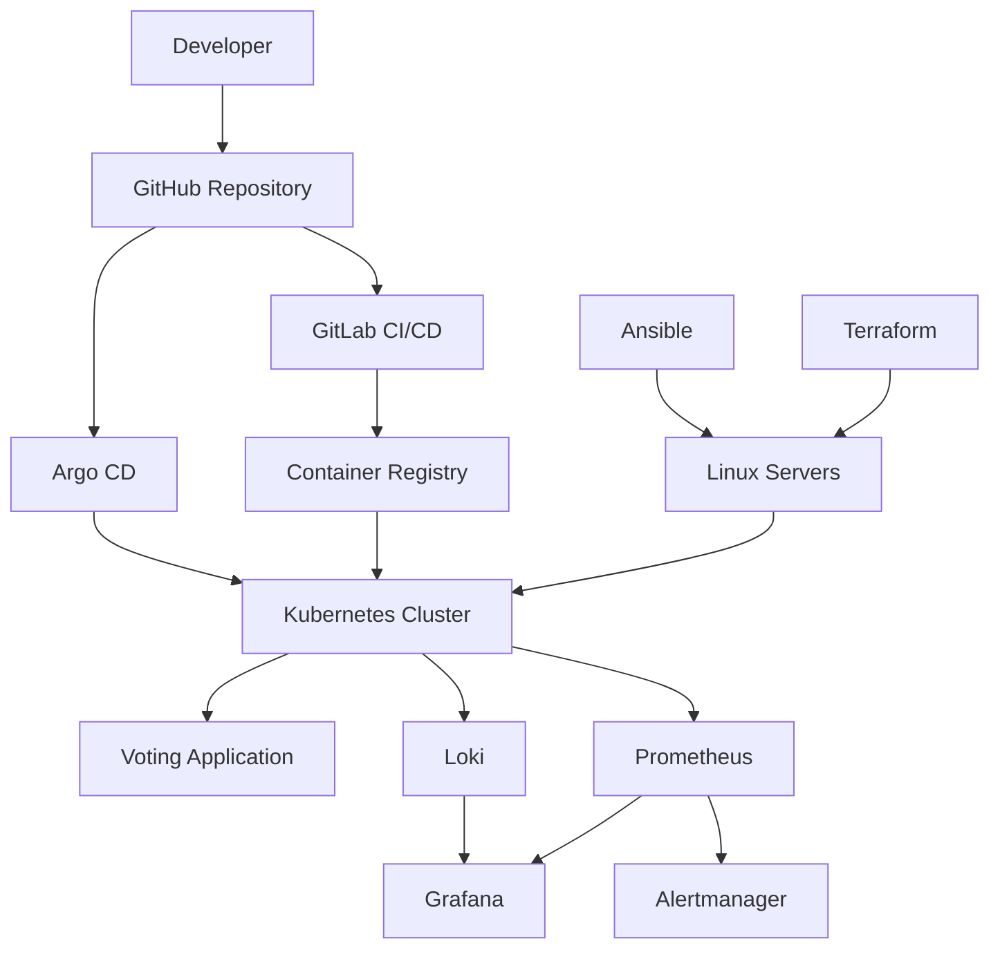

# OpsBoard

<p align="center">
  <strong>
    A production-like cloud-native DevOps platform designed to demonstrate infrastructure automation, Kubernetes operations, GitOps delivery, observability, security, and multi-environment deployment practices.
  </strong>
</p>

<p align="center">
  Linux · Docker · Kubernetes · Terraform · Ansible · Helm · Argo CD · GitHub · GitLab CI/CD · Prometheus · Grafana · Loki
</p>

---

## Overview

OpsBoard is a portfolio-grade DevOps project that demonstrates how to build, deploy, operate, monitor, secure, and reproduce a modern cloud-native platform.

The project is initially being developed inside a local VirtualBox lab using two Ubuntu Linux virtual machines. After the local environment is fully automated and validated, the same repository will be used to deploy the platform to real Linux servers.

The main goal is to manage infrastructure, configuration, applications, and platform services through code rather than manual administration.

---

## Project Status

> **Status: Work in progress**

The project is being implemented incrementally. Each completed phase will be documented and committed to version control.

### Current Progress

- [x] Git repository initialized
- [x] Base repository structure created
- [x] Security-focused `.gitignore` added
- [x] Initial project documentation created
- [x] Linux host preparation
- [x] SSH key-based automation
- [ ] Ansible inventory and roles
- [ ] Terraform infrastructure configuration
- [ ] Kubernetes cluster deployment
- [ ] Voting application integration
- [ ] Docker image build process
- [ ] Helm chart configuration
- [ ] GitLab CI/CD pipelines
- [ ] Argo CD GitOps deployment
- [ ] Prometheus metrics collection
- [ ] Grafana dashboards
- [ ] Loki centralized logging
- [ ] Alertmanager configuration
- [ ] Development environment validation
- [ ] Staging environment deployment
- [ ] Production environment deployment
- [ ] Security hardening
- [ ] Backup and recovery procedures

---

## Project Goals

OpsBoard is designed to demonstrate practical DevOps and cloud-native engineering skills across the full platform lifecycle.

The project will cover:

- Linux server administration
- Infrastructure as Code
- Configuration management
- Containerization
- Kubernetes cluster administration
- Continuous integration
- Continuous delivery
- GitOps-based deployments
- Multi-environment configuration
- Monitoring and alerting
- Centralized logging
- Secrets management
- Security scanning
- Reproducible infrastructure
- Backup and disaster recovery
- Production-style documentation

---

## Technology Stack

| Category | Technology |
|---|---|
| Operating System | Ubuntu Linux |
| Containerization | Docker |
| Container Runtime | containerd |
| Container Orchestration | Kubernetes |
| Kubernetes Bootstrap | kubeadm |
| Infrastructure as Code | Terraform |
| Configuration Management | Ansible |
| Kubernetes Package Management | Helm |
| GitOps | Argo CD |
| Source Control | GitHub |
| Continuous Integration | GitLab CI/CD |
| Container Registry | GitLab Container Registry |
| Metrics Collection | Prometheus |
| Dashboards | Grafana |
| Centralized Logging | Loki |
| Log Collection | Grafana Alloy |
| Alerting | Alertmanager |

---

## Environment Strategy

OpsBoard will support three separate deployment environments.

| Environment | Purpose |
|---|---|
| `dev` | Local development, experimentation, and frequent testing |
| `staging` | Production-like validation before release |
| `prod` | Stable production deployment |

The current VirtualBox lab represents the initial `dev` environment.

The same reusable Terraform, Ansible, Kubernetes, Helm, and Argo CD configuration will later be used for staging and production with environment-specific variables and policies.

Environment-specific information such as IP addresses, credentials, domain names, certificates, and secrets will not be hard-coded into the repository.

---

## Planned Architecture



---

## Repository Structure

```text
opsboard/
├── ansible/          # Linux configuration and Kubernetes automation
├── app/              # Voting application source code
├── argocd/           # Argo CD applications and GitOps configuration
├── docs/             # Architecture diagrams and project documentation
├── kubernetes/       # Kubernetes manifests and environment overlays
├── terraform/        # Infrastructure provisioning code
├── .github/          # GitHub-specific configuration
├── .gitlab/
│   └── ci/           # Reusable GitLab CI/CD pipeline templates
├── .gitignore
└── README.md
```

As the project grows, each major directory will contain its own documentation and environment-specific configuration.

---

## Deployment Workflow

The target application delivery workflow will follow this process:

```text
Developer
   │
   ▼
GitHub Repository
   │
   ▼
GitLab CI/CD
   │
   ├── Code validation
   ├── Unit testing
   ├── Docker image build
   ├── Dependency scanning
   ├── Container image scanning
   └── Image publishing
   │
   ▼
Container Registry
   │
   ▼
Argo CD
   │
   ▼
Kubernetes Cluster
   │
   ├── Voting Application
   ├── Prometheus
   ├── Grafana
   ├── Loki
   └── Alertmanager
```

---

## Infrastructure Workflow

The infrastructure deployment process will follow this sequence:

```text
Terraform
   │
   ▼
Linux Servers
   │
   ▼
Ansible
   │
   ├── Operating system configuration
   ├── Security hardening
   ├── containerd installation
   ├── Kubernetes package installation
   └── Cluster prerequisites
   │
   ▼
kubeadm
   │
   ▼
Kubernetes Cluster
   │
   ▼
Helm and Argo CD
   │
   ▼
Applications and Platform Services
```

---

## Observability

The platform will include a complete observability stack for metrics, dashboards, logs, and alerts.

### Metrics

Prometheus will collect metrics from:

- Kubernetes control-plane components
- Kubernetes worker nodes
- application workloads
- containers
- ingress controllers
- platform services

### Dashboards

Grafana will provide dashboards for:

- cluster health
- node utilization
- pod performance
- application metrics
- deployment status
- system alerts
- centralized logs

### Logging

Loki will provide centralized log storage.

Grafana Alloy will collect and forward logs from:

- Kubernetes pods
- application containers
- system services
- ingress components
- platform services

### Alerting

Alertmanager will process alerts generated by Prometheus and route them to configured notification channels.

---

## Security Principles

Security will be integrated throughout the project rather than added only at the end.

Planned security practices include:

- least-privilege Linux administration
- SSH key-based authentication
- restricted root access
- secrets excluded from Git
- encrypted Ansible variables
- protected CI/CD variables
- protected Terraform state
- container image scanning
- dependency scanning
- Kubernetes RBAC
- namespace isolation
- network policies
- pod security controls
- TLS certificate management
- secure secrets management
- audit logging
- firewall configuration

Sensitive values such as passwords, private keys, tokens, kubeconfig files, cloud credentials, and production secrets will never be committed to the repository.

---

## GitOps Strategy

Argo CD will continuously compare the desired state stored in Git with the actual state running inside Kubernetes.

The Git repository will remain the source of truth for:

- application deployments
- Kubernetes manifests
- Helm values
- environment overlays
- monitoring configuration
- logging configuration
- platform services

Changes will be reviewed, committed, and synchronized through Git rather than applied manually to the cluster.

---

## Local Development Environment

The initial development environment consists of two Ubuntu Linux virtual machines running in VirtualBox.

| Node | Role |
|---|---|
| `ubuntuvm1` | Kubernetes control-plane node and Ansible control node |
| `ubuntuvm2` | Kubernetes worker node |

This local environment will be used to build, test, destroy, and recreate the platform before it is deployed to real servers.

---

## Development Phases

The project will be completed in the following phases:

1. Repository and documentation foundation
2. Linux host preparation
3. SSH and access configuration
4. Ansible automation
5. Terraform infrastructure configuration
6. Kubernetes cluster deployment
7. Voting application integration
8. Docker image build and registry publishing
9. Helm packaging
10. GitLab CI/CD implementation
11. Argo CD GitOps deployment
12. Monitoring, logging, and alerting
13. Development environment validation
14. Staging environment deployment
15. Production environment deployment
16. Security hardening
17. Backup and disaster recovery
18. Final documentation and architecture diagrams

---

## Future Improvements

Potential future improvements include:

- high-availability Kubernetes control plane
- automated TLS certificates with cert-manager
- ingress controller deployment
- external secrets management
- automated backups
- disaster recovery testing
- policy enforcement
- vulnerability management
- horizontal pod autoscaling
- cloud infrastructure deployment
- service mesh integration
- blue-green deployments
- canary deployments
- advanced security monitoring

---

## Documentation

Additional documentation will be stored in the `docs/` directory.

Planned documentation includes:

- architecture diagrams
- installation instructions
- environment configuration
- troubleshooting guides
- security decisions
- monitoring dashboards
- disaster recovery procedures
- deployment runbooks
- operational checklists

---

## License

A license will be added before the project is published as a completed portfolio project.
