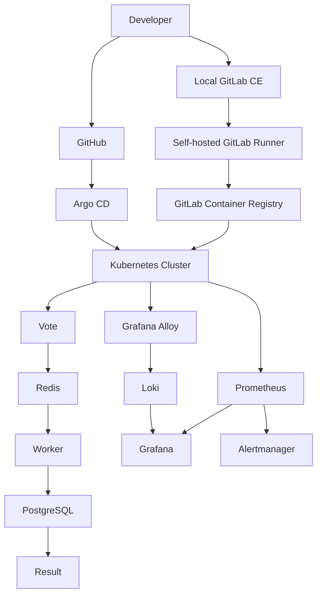

# OpsBoard

<p align="center">
  <strong>
    A production-style DevOps platform demonstrating Kubernetes, CI/CD,
    GitOps, automation, observability, security, and infrastructure engineering.
  </strong>
</p>

<p align="center">
  Linux · Docker · containerd · Kubernetes · Ansible · Terraform · Helm ·
  GitHub · GitLab CE · Argo CD · Prometheus · Grafana · Loki · Grafana Alloy
</p>

---

## Current Progress

> **Status: Work in progress**

- [x] Git repository and project structure
- [x] Linux host preparation
- [x] SSH key-based automation
- [x] Ansible automation
- [ ] Terraform infrastructure provisioning
- [x] kubeadm Kubernetes cluster
- [x] Voting application integration
- [x] Docker image build workflow
- [x] Kubernetes application deployment
- [x] Helm packaging
- [x] Local GitLab CE
- [x] Self-hosted GitLab Runner
- [x] GitLab CI/CD validation
- [x] Local GitLab Container Registry
- [x] Kubernetes private registry authentication
- [x] Argo CD GitOps deployment
- [x] Prometheus metrics collection
- [x] Custom application metrics
- [x] Persistent business metrics
- [x] Grafana executive dashboard
- [x] Loki centralized logging
- [x] Grafana Alloy log collection
- [ ] Alertmanager configuration
- [ ] Development environment validation
- [ ] Staging environment deployment
- [ ] Production environment deployment
- [ ] Final security hardening
- [ ] Automated backup and recovery

---

## Overview

OpsBoard is an end-to-end DevOps portfolio project built to demonstrate how a
modern application platform can be deployed, operated, monitored, secured, and
reproduced through automation.

The current environment runs on a two-node Ubuntu VirtualBox lab and includes:

- a kubeadm-based Kubernetes cluster
- Helm-managed application workloads
- GitHub source control
- self-managed GitLab CE for CI/CD and container images
- a self-hosted GitLab Runner
- Argo CD GitOps reconciliation
- Prometheus metrics collection
- Grafana dashboards
- Loki centralized logging
- Grafana Alloy log collection
- persistent PostgreSQL application data

The lab is intentionally being developed and validated locally before the same
automation patterns are used to rebuild the platform on physical Ubuntu
servers.

---

## Architecture



### Kubernetes Lab

| Node | Responsibilities |
| --- | --- |
| `ubuntuvm1` | Kubernetes control plane, Ansible control node, GitLab CE, GitLab Runner, local container registry |
| `ubuntuvm2` | Kubernetes worker, application workloads, Argo CD, monitoring and logging workloads |

The development environment currently uses a **single two-node Kubernetes
cluster** with platform components separated into namespaces.

Major namespaces include:

- `opsboard` — application workloads
- `argocd` — GitOps platform
- `monitoring` — Prometheus, Grafana, Alertmanager
- `logging` — Loki and Grafana Alloy
- `kube-system` — Kubernetes system components
- `local-path-storage` — dynamic local storage provisioning

---

## Application Flow

```text
Vote
 │
 ▼
Redis
 │
 ▼
Worker
 │
 ▼
PostgreSQL
 │
 ▼
Result
```

The application contains five core components:

- `vote` — Python/Flask voting frontend
- `redis` — vote queue
- `worker` — processes queued votes
- `postgres` — persistent system of record
- `result` — Node.js results frontend

Application images are stored in the local GitLab Container Registry and
deployed through the OpsBoard Helm chart.

---

## GitOps and Delivery

OpsBoard intentionally separates source control, CI/CD, image publishing, and
deployment reconciliation.

```text
Developer
   │
   ├──────────────► GitHub
   │                   │
   │                   ▼
   │                Argo CD
   │                   │
   │                   ▼
   │              Kubernetes
   │
   └──────────────► Local GitLab CE
                       │
                       ▼
                Self-hosted Runner
                       │
                       ▼
                 Image Registry
                       │
                       ▼
                   Kubernetes
```

### GitHub

GitHub is the primary source-control repository and the Git source watched by
Argo CD.

### GitLab CE

The local self-managed GitLab instance provides:

- GitLab CI/CD
- self-hosted pipeline execution
- container image storage
- deploy-token-based registry authentication

No paid GitLab-hosted/shared runners are required.

### Argo CD

Argo CD continuously compares the desired application state stored in GitHub
with the running Kubernetes cluster.

The OpsBoard Helm chart is the declarative deployment source of truth for the
application.

---

## Observability

OpsBoard includes metrics, dashboards, durable business metrics, and
centralized logging.

### Prometheus

Prometheus collects Kubernetes, infrastructure, and application metrics using
the Prometheus Operator and `ServiceMonitor` resources.

The Vote service exposes custom application metrics in addition to standard
platform metrics.

### Durable Business Metrics

Business totals are backed by PostgreSQL rather than relying only on
process-local Prometheus counters.

Persistent business metrics currently include:

- total votes
- votes by choice
- voting-page views

This means executive Grafana totals survive application pod and VM restarts.

Process-local counters are still retained where useful for operational rate
and trend analysis.

### Grafana

The custom **OpsBoard Executive Overview** dashboard currently includes:

- control-plane readiness
- worker readiness
- cluster node readiness
- OpsBoard pod readiness
- unhealthy pod count
- pod restart monitoring
- PostgreSQL PVC health
- PostgreSQL PVC capacity
- Prometheus target health
- CPU utilization by component
- memory utilization
- persistent total votes
- persistent page views
- votes by choice
- cumulative vote trends
- page-view trends
- OpsBoard log volume
- errors and warnings status
- recent OpsBoard logs

### Loki and Grafana Alloy

Centralized logging uses:

```text
Kubernetes Pods
      │
      ▼
Grafana Alloy
      │
      ▼
Loki
      │
      ▼
Grafana
```

Grafana Alloy discovers Kubernetes workloads and forwards their container logs
to Loki.

Logs can be queried using Kubernetes labels such as:

- `namespace`
- `app`
- `pod`
- `container`
- `cluster`

Grafana Explore provides interactive LogQL investigation while selected Loki
queries are also surfaced directly in the OpsBoard dashboard.

---

## Technology Stack

| Area | Technology |
| --- | --- |
| Operating system | Ubuntu Linux |
| Containers | Docker |
| Kubernetes runtime | containerd |
| Orchestration | Kubernetes / kubeadm |
| Configuration management | Ansible |
| Infrastructure as Code | Terraform |
| Package management | Helm |
| Source control | GitHub |
| CI/CD | GitLab CE / GitLab CI/CD |
| CI runner | Self-hosted GitLab Runner |
| Container registry | GitLab Container Registry |
| GitOps | Argo CD |
| Metrics | Prometheus |
| Dashboards | Grafana |
| Centralized logging | Loki |
| Log collection | Grafana Alloy |
| Alerting | Alertmanager |
| Database | PostgreSQL |
| Queue/cache | Redis |
| Kubernetes networking | Flannel |
| Dynamic storage | local-path provisioner |

---

## Repository Structure

```text
opsboard/
├── ansible/                  # Host and Kubernetes automation
├── app/
│   ├── vote/                 # Python voting service
│   ├── result/               # Node.js result service
│   └── worker/               # Vote processing worker
├── argocd/                   # Argo CD configuration
├── docs/                     # Detailed project documentation
├── helm/
│   └── opsboard/             # OpsBoard Helm chart
├── kubernetes/               # Kubernetes resources
├── logging/
│   ├── loki-values.yaml      # Loki Helm configuration
│   └── alloy-values.yaml     # Alloy log collection configuration
├── monitoring/               # Prometheus and Grafana configuration
├── systemd/                  # Persistent local browser-access services
├── terraform/                # Infrastructure-as-Code configuration
├── .gitlab-ci.yml            # GitLab CI/CD pipeline
├── ansible.cfg
└── README.md
```

---

## Automation Philosophy

The project follows a simple principle:

> Manual work is acceptable for learning and troubleshooting, but validated
> configuration should ultimately become reproducible code.

Automation currently or eventually covers:

- Linux preparation
- package installation
- container runtime configuration
- Kubernetes prerequisites
- Kubernetes cluster creation
- registry configuration
- application deployment
- CI/CD
- GitOps
- monitoring
- logging
- browser-access helper services
- infrastructure provisioning
- backup and recovery

The goal is to recreate OpsBoard on clean Linux machines rather than permanently
depending on the state of the current VirtualBox VMs.

---

## Security Approach

Security is incorporated throughout the project rather than treated only as a
final step.

Implemented or planned controls include:

- SSH key-based administration
- limited root usage
- non-root application containers
- Kubernetes security contexts
- secrets excluded from Git
- Kubernetes Secrets
- least-privilege GitLab deploy tokens
- protected CI/CD variables
- dependency scanning
- container image scanning
- Kubernetes RBAC
- namespace isolation
- network policies
- TLS
- firewall configuration
- backup and recovery controls

Passwords, private keys, tokens, kubeconfigs, registry credentials, and other
sensitive values must never be committed to the repository.

---

## Environment Strategy

The long-term platform design supports:

| Environment | Purpose |
| --- | --- |
| `dev` | Development, experimentation, and integration |
| `staging` | Production-like pre-release validation |
| `prod` | Stable production deployment |

The current VirtualBox environment represents the initial `dev` environment.

Environment-specific configuration will be controlled through variables,
values files, secrets, and policies rather than hard-coded production
information.

---

## Backup and Recovery

Backup and recovery remains an upcoming project milestone.

The final implementation will include:

- automated PostgreSQL backups
- scheduled backup execution
- retention policies
- off-node or external backup storage
- tested PostgreSQL restoration
- infrastructure configuration recovery
- Kubernetes recovery considerations
- documented disaster-recovery procedures

A successful backup alone will not be considered sufficient; recovery will be
validated through actual restore testing.

---

## Next Milestones

Current priorities are:

1. Configure Alertmanager and notification routing
2. Complete development-environment validation
3. Implement Terraform infrastructure provisioning
4. Automate PostgreSQL backup and recovery
5. Continue security hardening
6. Rebuild OpsBoard on physical Ubuntu servers
7. Introduce staging and production environment patterns

---

## Migration to Physical Servers

The VirtualBox lab is a development and learning platform, not the final
deployment target.

After the lab is fully validated, OpsBoard will be rebuilt from scratch on two
Ubuntu physical servers using repository automation rather than copying the
existing virtual machines.

The target reproduction process is:

```text
Terraform
    +
Ansible
    +
Kubernetes
    +
Helm
    +
GitLab CI/CD
    +
Argo CD
```

Development-only networking and access patterns will then be replaced with
production-appropriate DNS, TLS, firewall rules, secrets management, and
network architecture.

---

## Documentation

This README intentionally provides a high-level, scan-friendly overview.

Detailed implementation notes, architecture decisions, troubleshooting
history, operational procedures, and day-by-day build documentation belong in
the `docs/` directory.

This keeps the GitHub landing page easy to review while preserving the deeper
technical documentation needed for interviews, maintenance, and platform
reproduction.

---

## License

A project license will be finalized before OpsBoard is published as a completed
portfolio project.
