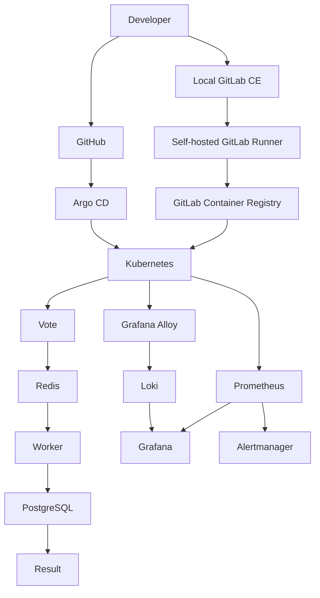

# OpsBoard

<p align="center">
  <strong>
    Production-style DevOps platform demonstrating Kubernetes, CI/CD,
    GitOps, automation, observability, security, and backup/recovery.
  </strong>
</p>

<p align="center">
  Linux · Docker · containerd · Kubernetes · Ansible · Terraform · Helm ·
  GitHub · GitLab CE · Argo CD · Prometheus · Grafana · Loki · Grafana Alloy
</p>

---

## Overview

OpsBoard is an end-to-end DevOps portfolio project built on a two-node Ubuntu lab.

It demonstrates how an application can be:

- containerized and deployed to Kubernetes
- packaged with Helm
- built and published through GitLab CI/CD
- promoted across Development, Staging, and Production
- reconciled through Argo CD GitOps
- monitored with Prometheus and Grafana
- logged through Loki and Grafana Alloy
- secured with Kubernetes RBAC and container security controls
- protected with automated PostgreSQL backup and tested recovery

The environment is intentionally small enough to run locally while still demonstrating production-style DevOps patterns.

---

## Completed Project Milestones

- [x] Git repository and project structure
- [x] Linux host preparation
- [x] SSH key-based automation
- [x] Ansible automation
- [x] Terraform infrastructure topology and environment modeling
- [x] kubeadm Kubernetes cluster
- [x] Voting application integration
- [x] Docker image build workflow
- [x] Kubernetes application deployment
- [x] Helm packaging
- [x] Local GitLab CE
- [x] Self-hosted GitLab Runner
- [x] GitLab CI/CD validation
- [x] Local GitLab Container Registry
- [x] Kubernetes private registry authentication
- [x] Argo CD GitOps deployment
- [x] Prometheus metrics collection
- [x] Custom application metrics
- [x] Persistent business metrics
- [x] Grafana executive dashboard
- [x] Loki centralized logging
- [x] Grafana Alloy log collection
- [x] Alertmanager configuration
- [x] Development environment validation
- [x] Staging environment deployment
- [x] Production environment deployment
- [x] Manual Staging / Production promotion workflow
- [x] Final security hardening
- [x] Automated PostgreSQL backup and recovery

---

## Architecture



### Kubernetes Lab

| Node | Responsibilities |
| --- | --- |
| `ubuntuvm1` | Kubernetes control plane, Ansible control node, GitLab CE, GitLab Runner, container registry |
| `ubuntuvm2` | Kubernetes worker, application workloads, Argo CD, monitoring, and logging |

The same Kubernetes cluster hosts three isolated application environments:

| Environment | Namespace |
| --- | --- |
| Development | `opsboard` |
| Staging | `opsboard-staging` |
| Production | `opsboard-prod` |

---

## Application

```text
Vote
  │
  ▼
Redis
  │
  ▼
Worker
  │
  ▼
PostgreSQL
  │
  ▼
Result
```

Core components:

- `vote` — Python/Flask voting frontend
- `redis` — vote queue
- `worker` — vote processing service
- `postgres` — persistent system of record
- `result` — Node.js results frontend

Application images are stored in the local GitLab Container Registry and deployed using the OpsBoard Helm chart.

---

## CI/CD and GitOps

OpsBoard separates CI from deployment reconciliation.

```text
Application change
      │
      ▼
GitLab CI/CD
      │
      ├── Build immutable images
      │
      ├── Publish commit-SHA images
      │
      ▼
Promote Development
      │
      ▼
Smoke Test
      │
      ▼
Promote Staging
      │
      ▼
Smoke Test
      │
      ▼
Promote Production
      │
      ▼
Smoke Test
```

Promotion jobs update environment-specific Helm values in Git.

Argo CD watches GitHub and remains the deployment authority for Kubernetes.

The same immutable image version is promoted from Development to Staging to Production instead of rebuilding per environment.

CI pipelines are filtered so documentation-only and unrelated changes do not create unnecessary pipelines.

Manual pipeline execution remains available for controlled releases and demonstrations.

---

## Observability

### Prometheus

Prometheus collects:

- Kubernetes health
- node metrics
- pod metrics
- application metrics
- persistent business metrics

### Grafana

The OpsBoard Executive Overview dashboard includes:

- control-plane and worker health
- cluster node readiness
- pod readiness
- unhealthy pod count
- pod restart monitoring
- PostgreSQL PVC health
- PostgreSQL PVC capacity
- Prometheus target health
- CPU utilization by component
- memory utilization
- persistent total votes
- persistent page views
- votes by choice
- cumulative vote trends
- page-view trends
- application log volume
- errors and warnings
- recent application logs

The dashboard supports switching between:

- Development
- Staging
- Production

### Centralized Logging

```text
Kubernetes Pods
      │
      ▼
Grafana Alloy
      │
      ▼
Loki
      │
      ▼
Grafana
```

Grafana Alloy discovers Kubernetes workloads and forwards container logs to Loki.

Logs can be queried using Kubernetes metadata such as:

- `namespace`
- `app`
- `pod`
- `container`
- `cluster`

### Alerting

Prometheus Alertmanager provides operational alerts and email notifications for selected infrastructure and application conditions.

---

## Security

Security controls implemented in OpsBoard include:

- SSH key-based administration
- secrets excluded from Git
- Kubernetes Secrets for runtime credentials
- private container-registry authentication
- masked CI/CD variables for sensitive credentials
- dedicated GitHub deploy key for CI promotion
- Kubernetes RBAC
- read-only Kubernetes access for GitLab CI smoke tests
- Argo CD as the application deployment authority
- non-root application images
- `allowPrivilegeEscalation: false` container security contexts
- namespace-based environment isolation

---

## Backup and Recovery

PostgreSQL backup automation is managed with Ansible and systemd.

The backup workflow:

- runs automatically every day
- backs up Development, Staging, and Production PostgreSQL databases
- stores backups on VM1 while PostgreSQL workloads run on VM2
- creates SHA-256 integrity checksums
- uses a rolling seven-day retention window
- automatically removes expired backups

Recovery was validated by restoring a Staging backup into a temporary PostgreSQL database.

The recovery test verified:

- backup checksum integrity
- successful `pg_restore`
- restored database schema
- restored `votes` data
- restored persistent business metrics

The temporary recovery database was removed after validation.

---

## Technology Stack

| Area | Technology |
| --- | --- |
| Operating system | Ubuntu Linux |
| Containers | Docker |
| Kubernetes runtime | containerd |
| Orchestration | Kubernetes / kubeadm |
| Configuration management | Ansible |
| Infrastructure modeling | Terraform |
| Package management | Helm |
| Source control | GitHub |
| CI/CD | GitLab CE / GitLab CI/CD |
| CI runner | Self-hosted GitLab Runner |
| Container registry | GitLab Container Registry |
| GitOps | Argo CD |
| Metrics | Prometheus |
| Dashboards | Grafana |
| Centralized logging | Loki |
| Log collection | Grafana Alloy |
| Alerting | Alertmanager |
| Database | PostgreSQL |
| Queue/cache | Redis |
| Kubernetes networking | Flannel |
| Dynamic storage | local-path provisioner |

---

## Repository Structure

```text
opsboard/
├── ansible/            # Host configuration and backup automation
├── app/                # Vote, Result, and Worker source
├── argocd/             # Argo CD applications
├── docs/               # Detailed implementation documentation
├── helm/
│   └── opsboard/       # OpsBoard Helm chart
├── kubernetes/         # Kubernetes resources and RBAC
├── logging/            # Loki and Grafana Alloy configuration
├── monitoring/         # Prometheus and Grafana configuration
├── systemd/            # Persistent local access services
├── terraform/          # Infrastructure topology/environment modeling
├── .gitlab-ci.yml      # CI/CD and promotion pipeline
└── README.md
```

---

## Documentation

This README is intentionally concise.

Detailed implementation notes, architecture decisions, troubleshooting history, operational procedures, and day-by-day project documentation are maintained under `docs/`.

---

## Future Deployment

The current two-VM VirtualBox environment is the validated lab implementation.

The same repository automation can later be used to reproduce the platform on two physical Ubuntu servers with production-oriented networking, DNS, TLS, firewall rules, and infrastructure-specific configuration.
